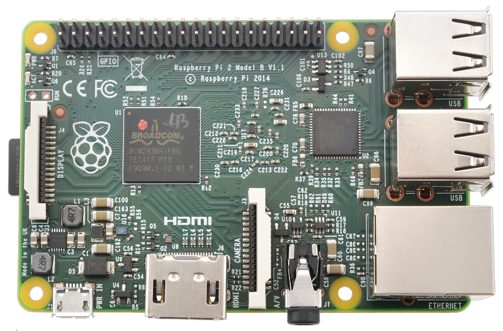
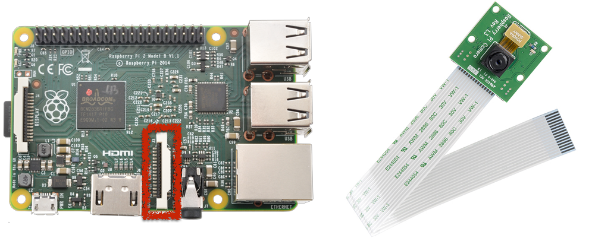
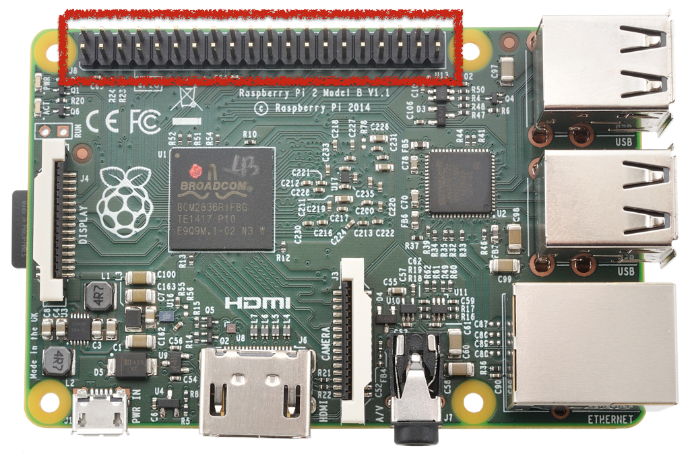

## Tutorial and Code: Image analysis with a Raspberry Pi and OpenCV. 

### CafeKrem fork 

my fork is here to test dockerisation of an openCV application and try to run it on a kubernetes cluster.


### QUICKSTART

This code takes a picture using webcam(s) and segments it into RGB using a python script. The images are then placed on a webstream. 

`git clone https://github.com/tmopencell/labvision.git`

`cd labvision`

`ifconfig`

Write down your IP adress. 

`./image_segment.sh`

This will take a photo (or photos) and place one in your current diretory and one in a directory for webstreaming.

You may also want to set this up on your `crontab` head to [Step 5](https://github.com/tmopencell/labvision#5-scripting-and-automating) for instructions. If you want to webstream head to [Step 6](https://github.com/tmopencell/labvision#6-streaming-to-the-web).

### Tutorial

There is no better way to automate activities than to use this £35  computer, the Raspberry Pi! Let’s talk about what this unit has and how that can be useful for those of you looking to document projects.

Note that much of this workshop is covered in far more detail on the dedicated [Raspberry Pi webpage](https://www.raspberrypi.org/documentation). Also if cost is a factor then([even cheaper products are available](https://thepihut.com/products/raspberry-pi-zero?variant=14062734980))!


Some basics:

If you have never used a raspi before please check out the setup page of the [Raspberry Pi webpage](https://www.raspberrypi.org/documentation). One of the neat features about the RPi is that you can log into it directly from your command line using the ssh command:

> `ssh pi@_IP_address_`

Which allows you to setup your pi in a fixed location and you can literally be anywhere in the world and work with it! You might need to set up a few items however, since this will require a fixed IP address and your internet service provider to permit traffic on TCP port 22 and if you want to use your pi as a webserver (which you should!) it is important to enable TCP port 80.

Chapters:
1. Setting up onboard camera
2. Setting up webcams
3. Python and OpenCV
4. Controlling an external lamp
5. Scripting and automating
6. Streaming to the web


#### 1. On Board Camera

The first impressive feature of this board is that you can mount a camera unit called the [raspi cam](https://www.raspberrypi.org/wp-content/uploads/2013/07/RaspiCam-Documentation.pdf). It mounts directly on the board.


This is fairly useful since a range of commands are already built in and setup is very straightforward:

 `sudo raspi-config`

Go to camera option and click enable. Done!

Some of the built in commands include “raspistill”. For eample:

 `raspistill -v -o test.jpg`

Will take a picture and save it as `test.jpg` in the current directory.

You can also create movies directly using “raspivid” in much the same way but this workshop is more about timelapses so we won’t bother with that. As a side note if you are interested in creating movies or using this setup as a home security system there is a fantastic github project: https://motion-project.github.io/ which covers this in great detail.

A very useful feature of the camera module is that you can [manually adjust](https://www.raspberrypi.org/blog/macro-photography-with-the-camera-board/) the position of the lens which allows you to use the system as a microscope. There is a group who have actually used this feature to produce [ultra-low cost microscopes](http://www.waterscope.org/) for developing world applications.

You can also modify the lens completely and replace it, check out [this tutorial](http://wiki.raspberrytorte.com/index.php?title=Camera_Module_Lens_Modifcation)! Also [this tutorial](http://www.truetex.com/raspberrypi) describes a similar project.


#### 2. Setting up webcams

You can also plug in webcams directly to the pi which is especially useful if you want to look at a number of things all at once. For instance you might like to use the built in raspicam as a microscope and have 2-3 webcams looking at different angles zoomed out.
This is very easy to setup, simply plug the webcams into the USB ports on the raspi board!


In our case we used the Logitech c270 which worked fine but some cameras may not work. Usually you will have to reboot the pi for the cameras to be registered by the machine:

`sudo reboot`

 And you can check if the cameras are being registered by:

`ls /dev/video*`

And depending on how many cameras you have installed you should see a list beginning at zero (usually your board camera will be zero).

The command that creates webcam images is different to the built in camera module. Install the `fswebcam` module:

`sudo apt-get install fswebcam`

Thne taking a photo is simply:

`fswebcam test.jpg`

Note that for multiple webcams you might want to specify which camera unit you want the photo to come from:

`fswebcam -d /dev/video_insert_video_number_ test.jpg`

#### 3. Python and OpenCV

It is assumed you have a basic understanding of python but if not there are great primers all over the web! One great place for raspi lovers is [Steve Computer Vision Blog](http://stevenhickson.blogspot.com/2013/04/how-to-fix-raspberry-pi-boot-problems.html).

The python portion of this project involves communicating with the General Purpose Input Output (see next chapter) and the image processing. OpenCV is a very cool machin vision package with a whole range of features built in. What we want to do with our images is to process them and only look at a particular colour (i.e. One of Red/Green/Blue). 

Assuming you have python alreay working you can use this line to install any missing packages:

`sudo pip install __missingpackage__`

You will need to run:

`sudo pip install numpy`
`sudo pip install opencv-python`

You can look through the colour analysis script here: color_analysis.py and this script is based on adapting the work of [pyimage](https://www.pyimagesearch.com/2014/08/04/opencv-python-color-detection/).

#### 4. Controlling an external lamp

The raspi has an extremely useful feature called the “General Purpose Input/Output” GPIO board.




This is an awesome feature since you can create innumerable electronic projects! A great introduction is available [here](https://www.raspberrypi.org/documentation/usage/gpio/).

We will use the GPIO board to do something very simple but very useful, [run a high voltage relay](http://www.forward.com.au/pfod/HomeAutomation/OnOffAddRelay/index.html).

Like most units a relay requires a small voltage to power it and this can be provided by the board itself. There are 5V, 3.3V and GND pins on the board. The output control is provided by dedicating a particular pin to turn off and on when commanded.

Writing a script to do this would begin by using you preferred text editor (default is nano) to create a python file:

`sudo nano light-on.py`

Copy the following text into the file (note “#” designates a comment):

```
import RPi.GPIO as GPIO
GPIO.setwarnings(False)

# Set pin numbering can use BOARD or BCM
GPIO.setmode(GPIO.BCM)

# Pick your pins
GPIO.setup(2, GPIO.OUT, initial=GPIO.LOW)

# Turn the pin on by setting it HIGH:
GPIO.output(2,GPIO.HIGH)

# Or if you want to turn it off set it LOW:
# GPIO.output(2,GPIO.LOW)
```

To exit type “`ctrl`” and “`x`” and type “`y`” when it asks do you want to save.

This program can then be run by typing:

`python light-on.py`

#### 5. Scripting and automating

The real advantage of the pi comes to light when you realise you can tell it to do multiple things and have them run when you want! We want to have a script that creates pictures for us (while turning on a lamp), creates a .gif file out of them and then place the images online for us to view.

For the .gif making install imagemagik:

`sudo apt-get install imagemagick`

you can create a _bash script_ to take your camera photos (see [documentation](https://www.raspberrypi.org/documentation/usage/webcams/) for more info):

Create a directory and file “webcam”:

```
mkdir webcam
sudo nano webcam.sh
```

Copy the following text into the file. For us we want to turn on a lamp and save files with time and date stamps:

```
#!/bin/bash
DATE=$(date +"%Y-%m-%d_%H%M%S")

# Turn your lamp (controlled by relay) on
sudo python light-on.py

# This handy command will simply delay the next command by a specified interval
# This is very useful if you need your lamp to warm up.
 echo "sleeping"
 sleep 20
 echo "done sleeping"
# This takes two photos and stores them in respective folders for each cam
 sudo fswebcam -d /dev/video1 -r 352x288 --no-banner /home/pi/webcam/cam1/$DATE.jpg
 sudo fswebcam -d /dev/video2 -r 352x288 --no-banner /home/pi/webcam/cam2/$DATE.jpg

# This command places another image (with time banner) into a folder that streams to the web note the file location “../../var/www”
 sudo fswebcam -d /dev/video1 -r 352x288 ../../var/www/webcam/cam1/timelapse.jpg
 sudo fswebcam -d /dev/video2 -r 352x288 ../../var/www/webcam/cam2/timelapse.jpg

# Now we pause the program and turn off the lamp (this may not be necessary for you!)
 echo "sleeping"
 sleep 20
 echo "shut off!"
 sudo python light-off.py

# Now we use the convert command (see imagemagik) to creat gifs
# The -delay gives the interval between picture changes and -loop sets it to repeat
sudo convert -delay 20 -loop 0 /home/pi/webcam/cam1/*.jpg /home/pi/webcam/cam1/timelapse.gif
sudo convert -delay 20 -loop 0 /home/pi/webcam/cam2/*.jpg /home/pi/webcam/cam2/timelapse.gif

 # Now we copy these gifs to the webstream folder  “../../var/www”
 sudo cp /home/pi/webcam/cam1/timelapse.gif ../../var/www/webcam/cam1/timelapse.gif
 sudo cp /home/pi/webcam/cam2/timelapse.gif ../../var/www/webcam/cam2/timelapse.gif
```

Make the file executable:

`chmod +x webcam.sh`

So now when you want to run this script, simply type:

`./webcam.sh`

And you will see updates including the “`echo sleeping`” note that we added.

However, you probably don’t want to have to run the command at fixed intervals since you are very busy. You can simply set your raspi to do it for you.... anytime you like! This is controlled in the [crontab](https://www.raspberrypi.org/documentation/linux/usage/cron.md). Edit this by typing:

`crontab -e`

And you can schedule the webcam.sh program to run every 30 minutes by typing:

`*/30 * * * * /home/pi/webcam.sh`

And exiting by typing `ctrl` `x` and when asked to save typing `y`.

What does this mean...? The "*" refers to
 minutes, hours, day of month, month, day of week
And you can read a better explanation [right here](http://www.adminschoice.com/crontab-quick-reference)!


#### 6. Streaming to the web

Once more the wonders of the raspi become clear! Not only is this an automation specialist but you can use it as a webserver! In fact this site (designbio.co.uk) is being run on a raspi server with [grav](https://getgrav.org/).

In this case remember you will need to speak to your internet service provider (ISP) to organise a static IP and enable traffic on TCP port 80 (also make sure to register TCP port 22). If you are in a university network for instance you can usually provide your ISP with your device’s unique “MAC address” and they can assign a fixed IP to this address when it is registered on the network. Alternatively you can [manually assign](https://www.modmypi.com/blog/how-to-give-your-raspberry-pi-a-static-ip-address-update) a fixed IP address.

Note: if you don’t enable traffic on ports 80, 22 you will usually be able to [ssh](https://www.raspberrypi.org/documentation/remote-access/ssh/) into your device and view your website within the network but not outside.

Note: find your MAC address by typing:

`ifconfig`

The letters and numbers listed after “HWaddr” are your MAC address

So to turn your raspi into a very basic webserver I recommend nginx:

 `sudo apt-get install nginx`

This will install and if successful you will be able to navigate to your IP address in your internet browser and see a page which says: `SUCCESS!`

There are a huge number of things you can do with a webserver that we wont cover here! You can setup a static page, or install php and setup wordpress. I personally prefer [grav](https://getgrav.org). So let’s stick with the absolute basics.

Nginx can be modified by editing the file stored in “`/etc/nginx/sites-available/default`”:

`sudo nano /etc/nginx/sites-available/default`

There is one line in this file that is of relevance to us right now:

`root /var/www/html`


Edit to read :

`root /var/www/webcam`

The original is the folder that contains the file “index.nginx-debian.html” which is the default nginx install page. We want to have a new directory called webcam which we can place our website stuff. So now we go to the directory “/var/www” and create this directory with our index.html file:

```
 cd /var/www
 mkdir webcam
 sudo nano webcam/index.html
 ```


In this file pastes the following, remebering to replace “`_Your-IP-address_`” with the IP address of your actual device.

```
<html>
<head>
<title> RPi Webcameras</title>
</head>
<body>
<center>
<h1>RPi Webcamera</h1>
<a href="http://_Your-IP-address_/cam1/timelapse.jpg">
</a> `
<a href="http://_Your-IP-address_/cam1/timelapse.gif">
</a> `
<br/>
<a href="http://_Your-IP-address_/cam2/timelapse.jpg">
</a>
<a href="http://_Your-IP-address_/cam2/timelapse.gif">
</a>
</center>
</body>
</html>
```

This will produce four images on a webpage with the left being the most recent image from your camera (one or two) and the right showing the collected timelapse in a .gif format. Very handy if you want to monitor progress while having a beer at the pub!

<html>
<head>
<title> RPi Webcameras</title>
</head>
<body>
<center>
<h1>RPi Webcamera</h1>
<a href="cam1/2019-07-09-120844.jpg">
</a>
<a href="cam1/timelapse.gif">
</a>

<br/>

<a href="cam2/2019-07-09-120845.jpg">
</a>
<a href="cam2/timelapse.gif">
</a>
</center>
</body>
</html>
